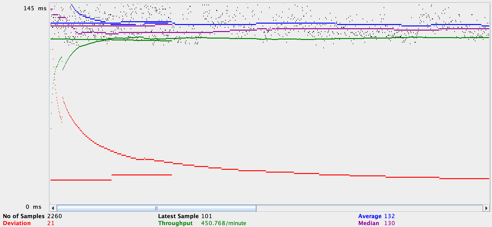
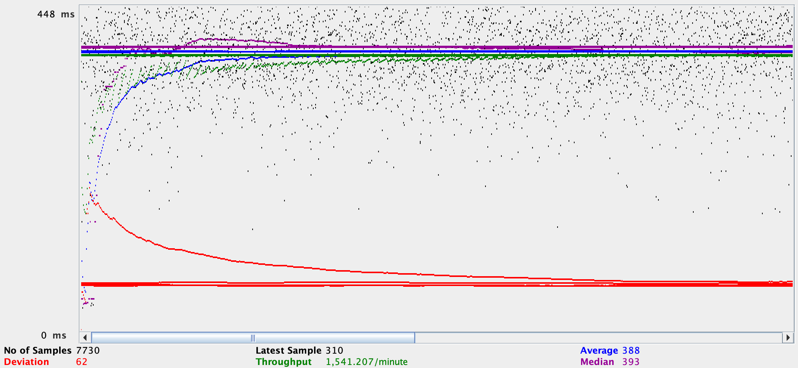
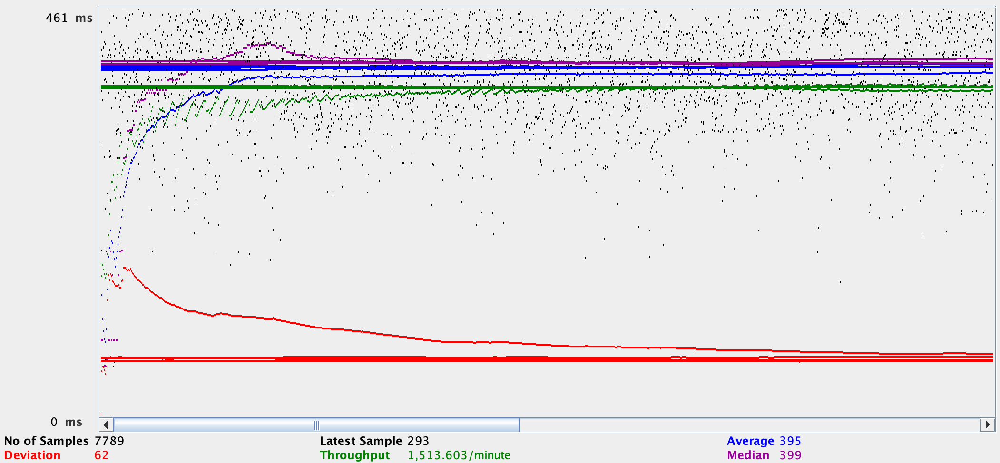
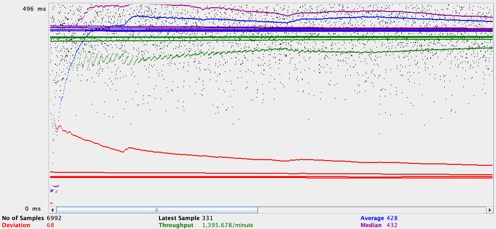
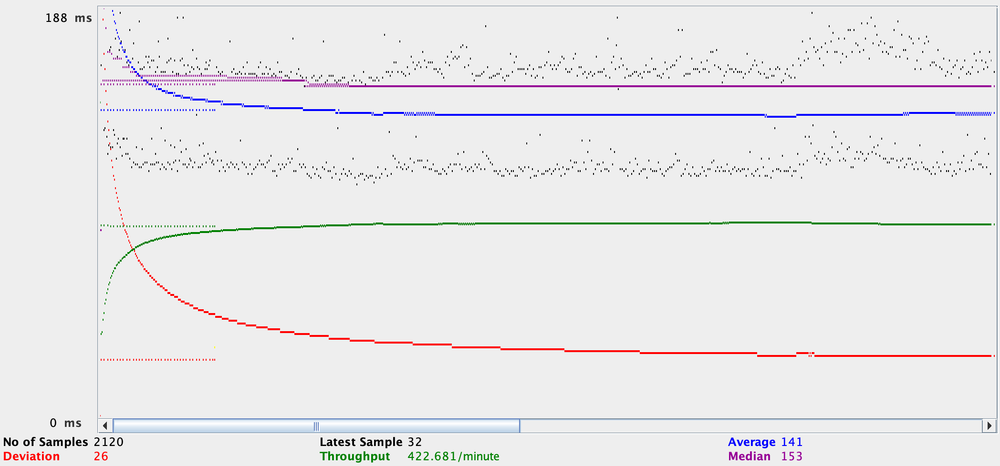
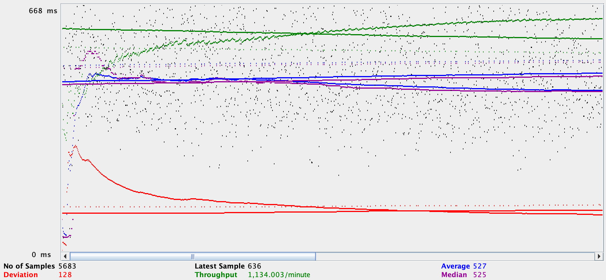
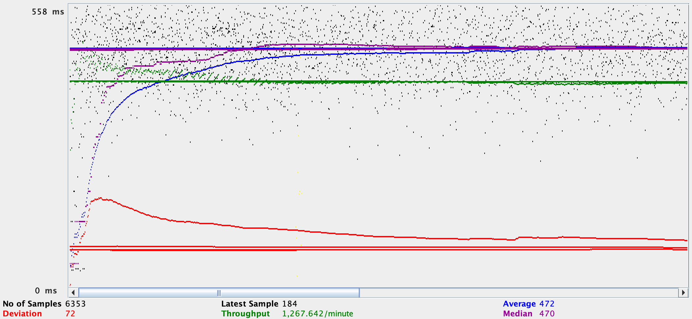

# 2023-fall-cs122b-team-night

- # General
    - #### Team#: Team-Night
    
    - #### Names: Daniel Bremner, Utsav Parajuli
    
    - #### Project 5 Video Demo Link:

    - #### Instruction of deployment:
      - Git Clone the repo, cd into the directory and run 'mvn package'.
      - Go to http://localhost:8080/manager/html/, load the package, and click the link provided

    - #### Collaborations and Work Distribution:
      - Daniel Bremner: Task 4.2-3, readme.md
      - Utsave Parajuli: Task 1-3, 4.1

- # Connection Pooling
    - #### Include the filename/path of all code/configuration files in GitHub of using JDBC Connection Pooling.
      - Webcontent/META-INF/context.xml
      - Webcontent/WEB-INF/web.xml
      - src/*.java
    
    - #### Explain how Connection Pooling is utilized in the Fabflix code.
      - Connections are defined in the context.xml file and called in each servlet in the src folder
      - Each defined connection has load balancing enabled, to a maximum of 100 connections.
      - Every time a request is made, if there are any idle connections than that connection is used, rather than having to open and close a new connection.
    
    - #### Explain how Connection Pooling works with two backend SQL.
      - In context.xml we allow the creation of a maximum of 100 cached connections for each defined connection.
      - In any writing calls we use a connection that points to the primary SQL server.
      - In any reading calls we use a connection that points to the primary/secondary SQL server.
      - Whenever a servlet is called instead of opening/closing a new connection one of the cached connections is used.
    

- # Master/Slave
    - #### Include the filename/path of all code/configuration files in GitHub of routing queries to Primary/Secondary SQL.
      - Webcontent/META-INF/context.xml
      - src/*.java

    - #### How read/write requests were routed to Primary/Secondary SQL?
      - We have two connections defined, one that points to the primary SQL server, and one that points to the secondary SQL server.
      - For any writing requests we use the connection that points to the primary server.
      - For any reading requests we use either a conneciton that points to the primary or secondary server.
    

- # JMeter TS/TJ Time Logs
    - #### Instructions of how to use the `log_processing.*` script to process the JMeter logs.
      - move log files (named tsMeasurement.txt and tjMeasurement.txt) to the logs folder
      - in terminal, cd to the logs directory, and run 'python3 log_processing.py'

- # JMeter TS/TJ Time Measurement Report

| **Single-instance Version Test Plan**          | **Graph Results Screenshot** | **Average Query Time(ms)** | **Average Search Servlet Time(ms)** | **Average JDBC Time(ms)** | **Analysis** |
|------------------------------------------------|------------------------------|----------------------------|-------------------------------------|---------------------------|--------------|
| Case 1: HTTP/1 thread                          |    | 132                        | 57                                  | 114                       | Given that we were only running thread, the results are as expected.           |
| Case 2: HTTP/10 threads                        |    | 388                        | 200                                 | 369                       | With 10x as many threads, performance accross the board was lowered.           |
| Case 3: HTTPS/10 threads                       |    | 395                        | 283                                 | 375                       | Performance slightly worse than http due to additional steps https has to perform for security.           |
| Case 4: HTTP/10 threads/No connection pooling  |    | 428                        | 281                                 | 410                       | Worst performance as everytime a call is made, a new connection has to be opened and then closed, rather than sharing them as in the pooling results.           |

                                                                                                                            TJ                                TS
| **Scaled Version Test Plan**                   | **Graph Results Screenshot** | **Average Query Time(ms)** | **Average Search Servlet Time(ms) ** | **Average JDBC Time(ms)** | **Analysis** |
|------------------------------------------------|------------------------------|----------------------------|--------------------------------------|---------------------------|--------------|
| Case 1: HTTP/1 thread                          |    | 141                        | 57                                   | 122                       | Slightly worse performance than the non scaled version, possibly due to the fact each call is redirected by apache loadbalancer.           |
| Case 2: HTTP/10 threads                        |    | 527                        | 379                                  | 508                       | With 10x as many threads, performance lowers due to loadbalancing operations.          |
| Case 3: HTTP/10 threads/No connection pooling  |    | 472                        | 315                                  | 453                       | We expected to see worse performance than the scaled 10 threads, but there ended up being a performmance increase. We are not quite sure why this is.           |
